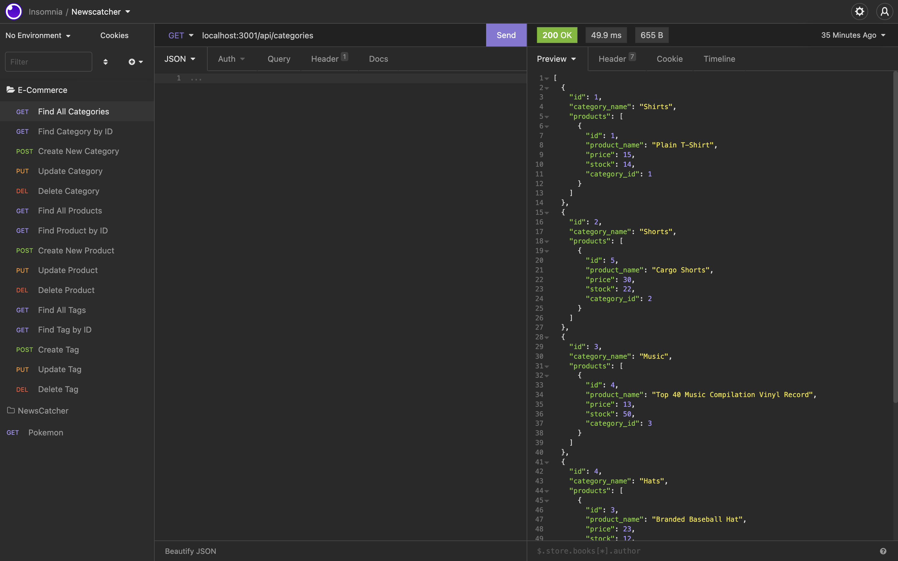

# E-Commerce Back End

[](https://opensource.org/licenses/MIT)

## Description

This a Node.js application that utilizes Sequelize to interact with a MySQL database of e-commerce products and their categories and tags.



## Demo

[Video Demonstration](https://drive.google.com/file/d/1DBhpGwiVQkEGUcnXIQsQZzwo0YTgPTJo/view?usp=sharing)

## Usage

To use this application, you must first install Node.js and MySQL. Then, install necessary dependencies with the following command:

```
npm i
```

Then create a .env file that includes your MySQL username and password with the following command:

```
cp .env.EXAMPLE .env
```

Then create and seed the database with following commands:

```
mysql -uroot -p
source db/schema.sql
exit
npm run seed
```

Now you may start the application with the following command:

```
node server.js
```

There is currently no front end for this application, so you must use Insomnia execute all requests.

### Questions

If you have any questions about this repository, open an issue or contact me directly at [pcragnol@gmail.com](mailto:pcragnol@gmail.com). You can find more of my work at [pcragnol](https://github.com/pcragnol/).

---
© 2022 Peter Cragnoline

Licensed under [MIT License](LICENSE)
